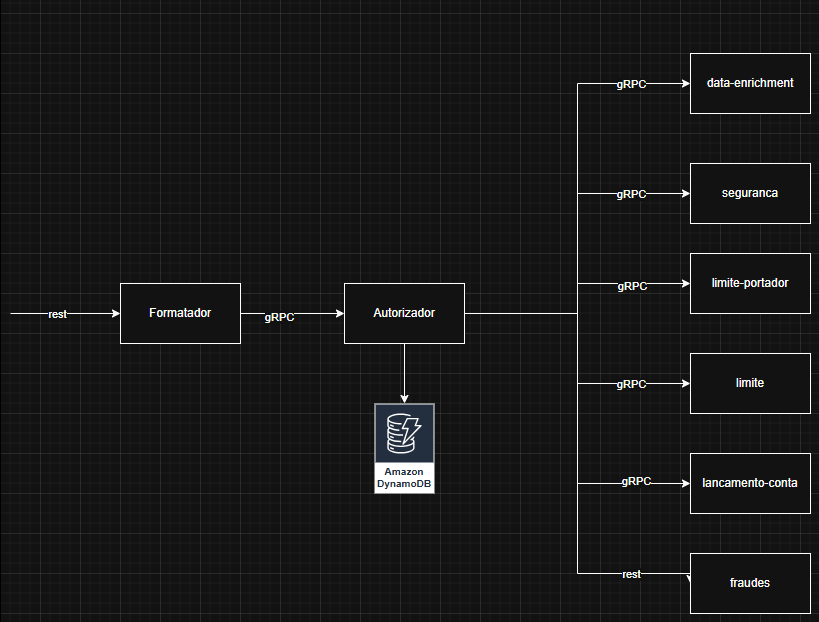

# PoC — Autorizador de Cartão de Débito (Java | gRPC + REST | AWS)

## Visão Geral
Este repositório contém uma **Prova de Conceito (PoC)** de um **Autorizador de Transações de Cartão de Débito**, com foco principal em **minimizar o tempo total de resposta** (end-to-end) mantendo **confiabilidade, rastreabilidade e observabilidade**.

A PoC valida padrões arquiteturais, estratégias de integração entre microserviços (gRPC e REST) e boas práticas para execução em **ambiente cloud (AWS)** visando **alta performance e baixa latência**.

---

## Objetivo
- Construir um fluxo de autorização de débito com **menor tempo possível de resposta**.
- Medir e comparar o impacto de:
  - **gRPC vs REST**
  - padrões de concorrência/paralelismo
  - configurações de infraestrutura e rede na AWS
  - timeouts, retries e circuit breakers
- Validar padrões de observabilidade e métricas para **TPS, latência, p95/p99**, erros e saturação.

---

## Requisitos Não-Funcionais (Foco)
- **Baixa latência** (principal KPI)
- **Alta concorrência / throughput**
- **Rastreabilidade por `transactionId`**
- **Resiliência controlada** (timeouts e falhas tratadas sem explodir latência)

---

## Arquitetura
> 


### Fluxo (alto nível)
1. Recebe requisição de autorização (entrada **REST** e/ou **gRPC**)
2. Orquestra chamadas para serviços dependentes (ex.: segurança, fraude, enriquecimento, limites etc.)
3. Consolida resposta e retorna **em tempo mínimo**
4. Em paralelo: registra telemetria e eventos (quando aplicável)

---

## Stack Tecnológica
- **Linguagem:** Java
- **Framework:** Spring Boot
- **Integrações:**
  - **gRPC** 
  - **REST** 
- **Observabilidade:** métricas, logs estruturados e tracing distribuído
- **Infra/Cloud:** AWS (ECS, VPC, dynamodb, endpoints privados etc.)
- **Testes de carga:** k6

---

## Principais Decisões de Design
- **Preferência por gRPC** para comunicação interna devido a:
  - menor overhead de serialização
  - HTTP/2 e multiplexing
  - contratos protobuf e compatibilidade
- **Timeouts agressivos e explícitos** por dependência 
- **Observabilidade “by default”**: métricas e logs estruturados por transação
- **Estratégia de paralelismo**: chamadas paralelas quando possível para reduzir latência total

---

## Estrutura do Repositório
```
.
├─ apps/
│  ├─ autorizador/              # serviço principal
│  └─ ...                       # serviços de apoio / mocks
├─ proto/                       # contratos gRPC (.proto)
├─ infra/                       # Terraform (opcional)
├─ docs/
│  ├─ arquitetura.png
│  └─ decisoes.md
├─ tests/
│  ├─ k6/                       # scripts de carga
│  └─ postman/                  # coleções REST
└─ README.md
```

---

## Como Executar (Local)
### Pré-requisitos
- Java `25` 
- Maven
- Docker

---

## Endpoints
### REST (exemplo)
- `POST /api/autorizacoes` — solicita autorização

### gRPC (exemplo)
- `AutorizadorService/Autorizar` — endpoint principal

> Documente aqui requests/responses e exemplos (JSON e protobuf).

---

## Configuração
As configurações são via variáveis de ambiente e/ou `application.yml`.

**Exemplos:**
- `GRPC_PORT=50051`
- `SERVER_PORT=8080`
- `TIMEOUT_MS_SEGURANCA=80`
- `TIMEOUT_MS_FRAUDE=120`
- `OTEL_EXPORTER_OTLP_ENDPOINT=http://localhost:4317`

> Recomenda-se manter timeouts por dependência, e não um timeout global único.

---

## Observabilidade
### Métricas recomendadas
- Latência por endpoint: **avg, p90, p95, p99**
- TPS (requests/s)
- Erros por tipo (timeout, unavailable, validation etc.)
- Saturação (fila, pool, CPU, GC, conexões)

### Logs estruturados
- Todos os logs com:
  - `transactionId`
  - `service`
  - `latencyMs`
  - `statusCode` (equivalente)
  - `dependency` (quando for chamada externa)

### Tracing
- Spans por dependência (Segurança/Fraude/Enriquecimento etc.)
- Correlação com logs pelo `traceId`/`transactionId`

---

## Estratégia de Teste de Performance
### Cenários (sugestão)
1. **Baseline**: endpoint único sem dependências (custo mínimo)
2. **gRPC interno**: dependências via gRPC
3. **REST interno**: dependências via REST
4. **Degradação**: latência artificial em uma dependência (validar cauda p99)
5. **Timeout & fallback**: validar comportamento e impacto

### Ferramentas
- k6 / Gatling
- Dashboards (Datadog / Grafana)

---

## Considerações AWS (sugestões para baixa latência)
- Preferir comunicação **intra-VPC**
- Avaliar **VPC Endpoints** (Gateway/Interface) quando aplicável
- Ajustar:
  - health checks
  - autoscaling por **latência** e **CPU**
  - configuração de rede (ALB/NLB) conforme protocolo
- Evitar hops desnecessários (ex.: NAT quando não precisa)

---

## Roadmap da PoC
- [ ] Primeira versão do endpoint de autorização (gRPC + REST)
- [ ] Integração com serviços dependentes (mock + real)
- [ ] Observabilidade completa (métricas + logs + tracing)
- [ ] Cenários de carga e relatório comparativo
- [ ] Ajustes finos de timeouts / paralelismo / retries
- [ ] Documento final de conclusões e recomendações

---

## Resultados & Relatórios
> Coloque aqui os links para relatórios, dashboards e prints.

- Dashboard: `docs/dashboards/...`
- Relatório k6/Gatling: `docs/perf/...`
- Conclusões: `docs/conclusoes.md`

---

## Licença
Defina a licença (ou “uso interno”).
